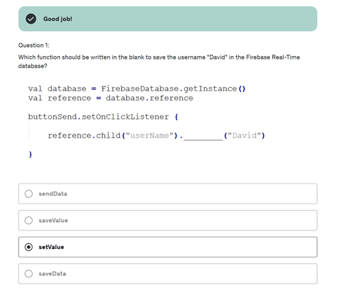
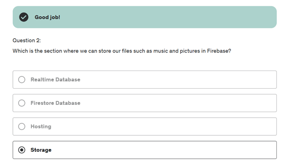

# Лабораторна робота №6
## Програмування для мобільних пристроїв
### Харківський національний економічний університет ім. С.Кузнеця

**Виконала**: Бабачанах К.С., студентка 4 курсу групи 6.04.122.010.21.2, факультету ІТ

---

## Вступ

Цей репозиторій містить усі виконані роботи та проекти.

---

## Огляд розділів

### Section 27: Introduction to Firebase

У цьому розділі розглядалися наступні теми, пов’язані з Firebase та розробкою додатків для Android на мові програмування Kotlin:

1.	**Firebase** - Вступ до Firebase як платформи, яка допомагає розробникам швидко створювати якісні додатки. Firebase надає інструменти для трекінгу аналітики, звітів про збої, баз даних та конфігурацій облачних послуг.

2.	**FAQ Firebase, розробку додатків для Android і Kotlin** - Обговорення найбільш типових питань про використання Firebase, особливості розробки додатків для Android і переваги використання Kotlin у якості основної мови програмування.
3.	**Продукти, які пропонує Firebase** - Детальний огляд продуктів Firebase, таких як Firebase Realtime Database, Firebase Firestore, Firebase Authentication. Обговорення, як ці інструменти можуть спростити розробку і підвищити ефективність додатків.

4.	**Політика ціноутворення Firebase, обмеження та квоти** - Пояснення моделей ціноутворення Firebase, включно з безкоштовними та платними планами, та обговорення лімітів використання ресурсів.
5.	**Корисні посилання про Firebase, розробку додатків для Android та Kotlin** - Надання додаткових ресурсів та посилань для глибшого вивчення платформи Firebase та особливостей розробки додатків.

- **У кінці секції 27 я пройшла тест  **
  

---

### Section 28: Firebase Realtime Database

У цьому розділі розглядалися наступні аспекти роботи з Firebase Realtime Database та її інтеграцією з Android Studio:

1.	**Створення Firebase Database** - Основи створення та налаштування бази даних у Firebase для використання в реальному часі.
2.	**Інтеграція Firebase з Android Studio** - Детальне керівництво по інтеграції Firebase з проектами в Android Studio, включаючи налаштування та конфігурацію.
3.	**Додавання даних у реальному часі до бази даних через Firebase Console** - Як використовувати консоль Firebase для додавання та управління даними в реальному часі.
4.	**Додавання даних до Real-Time Database через Android додаток** - Реалізація функціональності додавання даних від користувачів через Android-додаток у Firebase Database.
5.	**Отримання даних із бази даних у реальному часі у додаток** - Практика та методи отримання даних з Firebase Database у мобільний додаток в режимі реального часу.

- **Firebase realtime Database**
  

- **Quiz 28**
  

---

### Section 29: User Registration App using Firebase and Kotlin in for Android App.

У секції розглядаються наступні теми:

1.	**Введення в проєкт** - Загальний огляд проєкту реєстрації користувачів з використанням Firebase та Kotlin для Android. Обговорюється мета проєкту та ключові компоненти, які будуть розроблені.
2.	**Дизайн додатка** - Опис дизайну інтерфейсу користувача та структури додатка. Розглядаються макети, використання компонентів інтерфейсу та архітектурні рішення, які покращують досвід користувача і забезпечують ефективну навігацію всередині додатка.
3.	**Додавання користувача до бази даних у реальному часі** - Покроковий опис процесу додавання даних користувача до Firebase Realtime Database. Обговорюються методики валідації даних і забезпечення їхньої консистентності при передачі в базу даних.
4.	**Витягування даних з Firebase Realtime Database** - Опис процесу отримання даних з бази даних у реальному часі Firebase. Розглядаються запити до бази даних, обробка відповідей та інтеграція отриманих даних у додаток.
5.	**Відображення отриманих даних на RecyclerView** - Детальне пояснення того, як відображати дані з Firebase в RecyclerView на Android. Обговорюється налаштування адаптерів, оптимізація відображення списків та взаємодія користувача зі списковими елементами.
6.	**Оновлення даних користувача** - Опис процесу оновлення даних користувача в Firebase Realtime Database. Розглядаються методи збереження змін, обробки помилок та забезпечення цілісності даних під час оновлення.
7.	**Видалення обраного користувача** - Покроковий опис процесу видалення даних конкретного користувача з Firebase. Обговорюються техніки безпечного видалення, що запобігають втраті важливої інформації.
8.	**Видалення всіх користувачів з бази даних**  - Обговорення методів видалення всіх даних користувачів з бази даних Firebase Realtime Database. Розглядаються питання безпеки та оптимальні підходи для виконання масового видалення.

- **Quiz 29**
  

---

### Section 30: Authentication with Firebase 

У секції обговорюються різні методи аутентифікації користувачів за допомогою Firebase у проекті Android за допомогою Kotlin. Ось докладний огляд тем, що вивчаються:

1.	**Введення в аутентифікацію** - Вступ до основ аутентифікації користувачів у додатках. Обговорюється значення безпеки користувачів і загальні підходи до аутентифікації.

2.	**Аутентифікація за допомогою електронної пошти та пароля** - Налаштування Firebase і інтеграція форми входу у додаток. Розробка процедур реєстрації користувачів та управління сесіями. Впровадження додаткових заходів безпеки та оптимізація процесу аутентифікації.
   

3.	**Запам'ятовування користувача за допомогою Firebase** - Розробка механізму, який дозволяє додатку запам'ятовувати користувача після його виходу, щоб він міг автоматично увійти при наступному запуску додатка.
4.	**Додавання опції відновлення забутого пароля**  - Імплементація функції відновлення пароля, яка дозволяє користувачам скидати свій пароль через електронну пошту в разі його втрати.
5.	**Аутентифікація за допомогою телефону** - Вивчення методу аутентифікації через SMS:  Налаштування та інтеграція сервісу аутентифікації через телефон з використанням Firebase. Розширення функціоналу, обробка SMS повідомлень, перевірка та верифікація коду, отриманого користувачем.

- **Authentication with Phone with Firebase**

- **Quiz 30**
  

---

### Section 31: Push Notification with Firebase

У секції основна увага приділяється розсилці сповіщень через Firebase у додатках Android з використанням Kotlin. Було детальне пояснення процесу налаштування та використання Firebase Cloud Messaging (FCM) для відправлення push-сповіщень користувачам мобільних додатків. Розглядались такі аспекти:

•	Налаштування Firebase та інтеграція необхідних сервісів у ваш Android проект.
•	Створення та налаштування push-сповіщень через Firebase консоль.
•	Обробка отриманих сповіщень в додатку, щоб забезпечити відповідну реакцію на них.

- **Android Push Notifications**

- **Quiz 31**
  

---

### Section 32: Cloud Storage with Firebase

Секція охоплює використання Cloud Storage від Firebase для зберігання та управління зображеннями у додатках Android.

Перший урок вводить Cloud Storage від Firebase, описуючи його можливості та переваги для зберігання файлів у хмарі. Обговорюються основи налаштування та інтеграції хмарного сховища у ваш проект.

Далі демонстрація, як використовувати інтенти Android для вибору зображення з галереї користувача.

Я дізналась як зберегти вибране зображення у Firebase Cloud Storage, включаючи налаштування правил доступу та збереження файлів.Також, як відобразити зображення, збережене у хмарі, в елементі управління списком Android.

Було розглянуто методи оновлення файлів у Cloud Storage, включаючи заміну старих зображень новими. Та процес масового видалення зображень.

- **Cloud Storage with Firebase**

- **Quiz 32**
  

---

### Section 33: Rest API and Retrofit Library

Секція присвячена використанню бібліотеки Retrofit для роботи з Rest API у додатках Android.

Я дізналась про бібліотеку Retrofit, яка є типовим клієнтом HTTP для Android та Java, що спрощує взаємодію з RESTful веб-сервісами. Було обговорення як налаштувати Retrofit та інтегрувати його в ваш проект.

Я розглянула процес налаштування з’єднання з Rest API, використання GET-запитів для отримання даних, обробку відповідей та помилок. Навчилась створювати сервісні інтерфейси у Retrofit, які визначають кінцеві точки API і відповідні методи HTTP.

Також, було розглянуто інтеграцію отриманих даних у компонент відображення списку (RecyclerView) у додатку. Була інформація про налаштування адаптера RecyclerView, створення макетів елементів списку та відображення даних у динамічному інтерфейсі користувача

- **Quiz 33**
  

---

### Section 34: Quiz Game Project

У цій секції потрібно було створити квіз.

- **Завантаження**

- **Головна сторінка**
  

- **Реєстрація**
  

- **Вводжу дані**

- **Зайшла у систему**
  

- **Починаю грати, завантаження квізу**
  

- **Вийшла з системи**

- **Забула пароль**
  

- **Тост повідомлення що смс було отправлено для відновлення паролю**
  

- **Quiz 34**
  

---

## Заключення

Цей курс забезпечив глибоке знайомство з розробкою мобільних додатків на платформі Android, зосереджуючись на практичному застосуванні теоретичних знань.

---

### Усі секції пройдені

